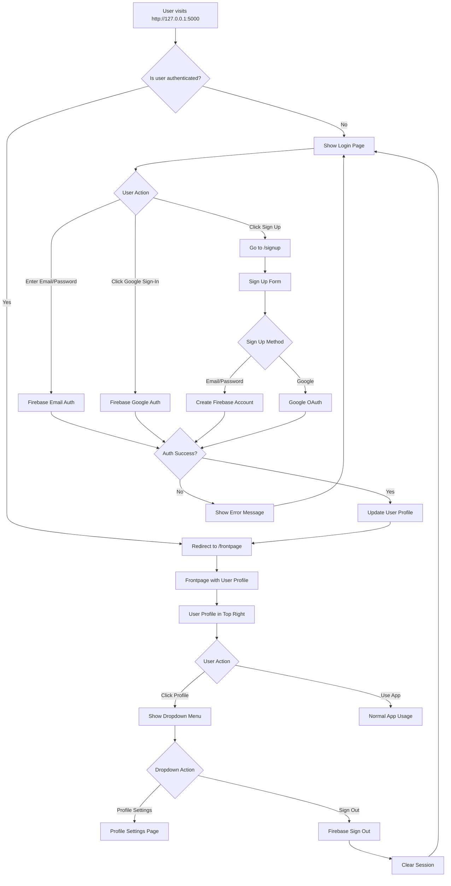

# Authentication Flow Diagram

## User Journey



## Authentication States

### 1. **Unauthenticated State**
```
┌─────────────────────────────────┐
│      Login Page (/)             │
│                                 │
│  ┌─────────────────────────┐   │
│  │  Email: _______________  │   │
│  │  Password: ___________  │   │
│  │  [Sign In Button]       │   │
│  └─────────────────────────┘   │
│                                 │
│  [Sign in with Google]          │
│  [Don't have account? Sign Up]  │
└─────────────────────────────────┘
```

### 2. **Authenticated State**
```
┌─────────────────────────────────────────────────┐
│  Frontpage (/frontpage)                         │
│  ┌──────────────────────────────────────────┐   │
│  │ [☰ Menu]              [👤 User ▼]       │   │
│  └──────────────────────────────────────────┘   │
│                                                  │
│  When clicking profile:                         │
│  ┌──────────────────────┐                       │
│  │ John Doe             │                       │
│  │ john@example.com     │                       │
│  ├──────────────────────┤                       │
│  │ 👤 Profile Settings  │                       │
│  ├──────────────────────┤                       │
│  │ 🚪 Sign Out          │                       │
│  └──────────────────────┘                       │
│                                                  │
│  [ManoChitra App Content]                       │
└─────────────────────────────────────────────────┘
```

## Firebase Authentication Flow

### Email/Password Sign In
```
User enters credentials
        ↓
auth.signInWithEmailAndPassword(email, password)
        ↓
    Firebase validates
        ↓
   ┌────┴────┐
   │         │
Success    Failure
   │         │
   ↓         ↓
Store    Show Error
Session   Message
   ↓
Redirect to
/frontpage
```

### Google Sign In
```
User clicks Google button
        ↓
auth.signInWithPopup(googleProvider)
        ↓
    Google OAuth popup
        ↓
   User selects account
        ↓
   ┌────┴────┐
   │         │
Success    Failure
   │         │
   ↓         ↓
Get user   Show Error
profile    Message
   ↓
Store session
   ↓
Redirect to
/frontpage
```

## Session Management

### On Page Load
```javascript
auth.onAuthStateChanged((user) => {
    if (user) {
        // User is signed in
        updateUserProfile(user);
        // Show protected content
    } else {
        // No user signed in
        redirect to login
    }
});
```

### User Profile Data
```javascript
{
    displayName: "John Doe",
    email: "john@example.com",
    photoURL: "https://...",  // From Google
    uid: "unique-user-id",
    emailVerified: true/false
}
```

## Page Protection Flow

```
┌──────────────────────────────────────────┐
│  Every Protected Page                    │
│                                          │
│  1. Load Firebase SDK                    │
│  2. Check auth.currentUser               │
│  3. If null → redirect to /              │
│  4. If user → show page content          │
│  5. Update profile UI with user data     │
└──────────────────────────────────────────┘
```

## Error Handling

### Common Errors and Responses
```
auth/user-not-found
  → "No account found with this email."

auth/wrong-password
  → "Incorrect password. Please try again."

auth/email-already-in-use
  → "An account with this email already exists."

auth/weak-password
  → "Password is too weak. Use at least 6 characters."

auth/popup-closed-by-user
  → "Sign-in cancelled."

auth/popup-blocked
  → "Popup blocked. Please allow popups for this site."
```

## Security Layers

```
┌─────────────────────────────────────────┐
│  Layer 1: Client-Side Auth Check        │
│  - onAuthStateChanged listener           │
│  - Redirect if not authenticated         │
└─────────────────────────────────────────┘
                  ↓
┌─────────────────────────────────────────┐
│  Layer 2: Firebase Token Validation     │
│  - Firebase handles token management     │
│  - Automatic token refresh               │
└─────────────────────────────────────────┘
                  ↓
┌─────────────────────────────────────────┐
│  Layer 3: Session Persistence            │
│  - Browser localStorage                  │
│  - Survives page refreshes               │
└─────────────────────────────────────────┘
```

## User Profile Update Flow

```
User signs in
     ↓
Firebase returns user object
     ↓
Extract user data:
  - displayName
  - email
  - photoURL
     ↓
Update UI elements:
  - Avatar (photo or initials)
  - Dropdown name
  - Dropdown email
     ↓
Profile visible in top right
```

## Logout Flow

```
User clicks "Sign Out"
        ↓
auth.signOut()
        ↓
Firebase clears session
        ↓
onAuthStateChanged fires
        ↓
user = null
        ↓
Redirect to login page
```

---

This flow ensures secure, seamless authentication throughout your Manochitra application!
